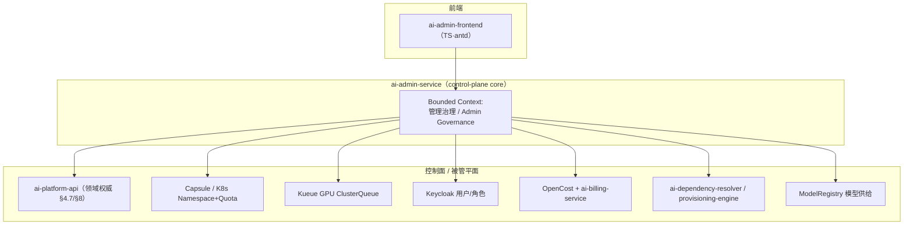
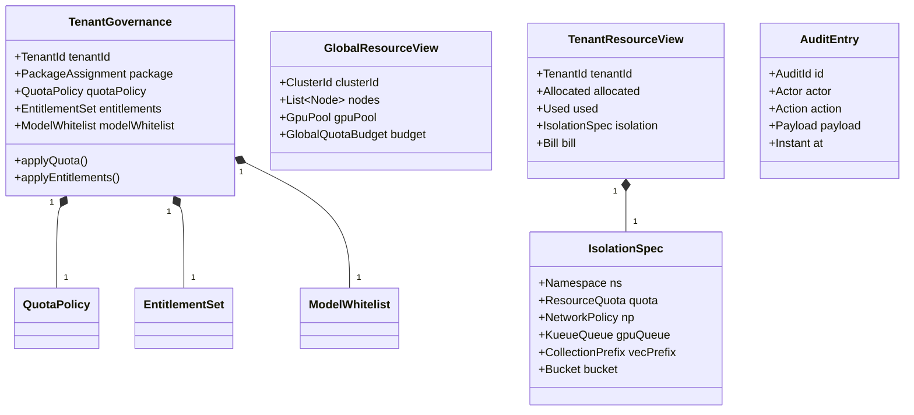
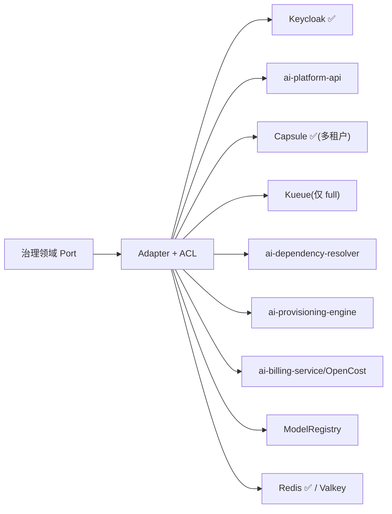
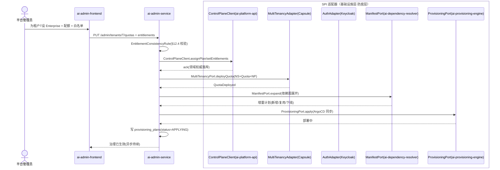
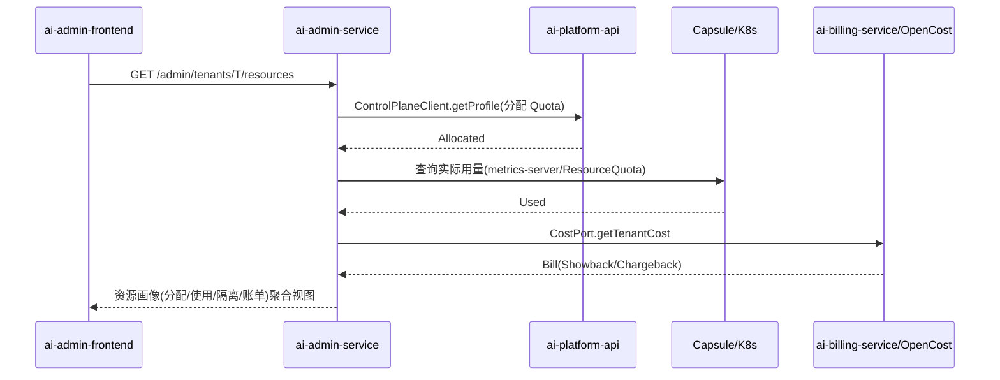

# ai-admin-service · 详细设计文档

> **元信息**
> | 项 | 值 |
> | --- | --- | --- |
> | repo | `ai-admin-service` |
> | 语言·框架 | Java · Spring Boot 3.x（Jakarta Persistence，§15.6.1） |
> | 领域 | control-plane |
> | optional | 否（core，starter~full 全程启用，见 `repos.yaml` / `profiles/*.yaml`） |
> | 平台版本 | v1.4.0 |
> | 文档状态 | 草稿 |
> | 负责人 | OpenStrata 架构组 |
> | 关联链接 | [arch](./arch/ARCH.md) · [skills](./skills/SKILLS.md) · [specs](./specs/SPECS.md) · 架构文档 [§14](../../OpenStrata架构设计文档 v2.8.md) [§8](../../OpenStrata架构设计文档 v2.8.md) [§4.7](../../OpenStrata架构设计文档 v2.8.md) [§12](../../OpenStrata架构设计文档 v2.8.md) [§15.6](../../OpenStrata架构设计文档 v2.8.md) [§16](../../OpenStrata架构设计文档 v2.8.md) |

> 本文档覆盖现有占位骨架，不改动 `arch/`、`skills/`、`specs/`、`README.md`。章节严格按 16 节组织，图一律用 live ```mermaid```。

---

## 1. 领域上下文与边界（Bounded Context）

`ai-admin-service` 是 OpenStrata **整体管理 Portal 的后端**（架构文档 §14，v2.2 新增）。它面向**平台管理员 / 租户管理员**，统一治理「租户、用户、平台全局资源、租户对应资源」，并把治理决策落地为隔离载体（Capsule/K8s/Kueue/Keycloak）与 tenant 级 `PlatformManifest`（§12）。它与**引导 Portal**（ai-guide-portal，能力装配）职责互补：管理 Portal 设定"边界"（配额 + 可启用组件 + 模型白名单），引导 Portal 在边界内让用户"自选能力"（§14）。



- **边界（上游）**：只接受 `Auth` SPI 鉴权（Keycloak，§4.7.3）；平台级 vs 租户级角色作用域严格分离（§14.3）。
- **边界（下游）**：是**治理编排后端**，经 SPI/ACL 调用 ai-platform-api（领域权威）、Capsule/K8s（隔离）、Kueue（GPU）、Keycloak（用户）、OpenCost/billing（成本）、dependency-resolver/provisioning（组件启停）。自身不持有租户/用户的权威数据（在 platform-api），只编排与镜像视图。
- **可选性**：core，四档均启用。端口 8088（§15.2）。

---

## 2. 职责与能力清单（映射 §4 各层职责）

对齐 §14 四大治理域与 §4.7（安全治理与多租户层）：

| 能力 | 说明 | 映射 § |
| --- | --- | --- |
| 租户管理 | 生命周期 CRUD / 套餐 / 启停 / 隔离配置（§14.2） | §14.2 / §8.1 |
| 用户管理 | SSO/LDAP/AD 对接、RBAC 四角色、生命周期（§14.3） | §14.3 / §4.7.3 |
| 全局资源管理 | 集群节点/GPU 池/共享服务/全局配额/平台成本/容量规划（§14.4） | §14.4 |
| 租户资源管理 | 分配 vs 使用 / 隔离载体 / 账单（Showback/Chargeback，§14.5） | §14.5 / §8.3 |
| 配额下发 | 套餐配额 → Capsule/Kueue/网关（§14.2/§14.5） | §8.2 / §14.5 |
| 组件范围设定 | 租户可启用组件白名单 → tenant `PlatformManifest`（§14.2） | §12.1 / §14.2 |
| 供应商授权 | 按租户开放第三方模型（§14.2） | §14.2 |
| 安全与审计 | 管理员 MFA、最小权限、全量审计（§14.6） | §14.6 / §4.7.4 |
| 编排闭环 | 依赖图展开 → dependency-resolver 出计划 → provisioning 增量部署（§14.5） | §13.3 |

---

## 3. 领域模型（Aggregate / Entity / Value Object / 领域事件）



**Aggregate（聚合根）**：`TenantGovernance`（租户治理聚合：套餐+配额+组件白名单+模型白名单）、`GlobalResourceView`、`TenantResourceView`、`AuditEntry`（不可变）。

**Entity（实体）**：`QuotaPolicy`、`EntitlementSet`、`ModelWhitelist`、`IsolationSpec`、`Node`、`GpuPool`。

**Value Object（值对象）**：`TenantId`/`ClusterId`/`AuditId`、`PackageAssignment`（Trial/Standard/Enterprise）、`ResourceQuota`（CPU/Mem/GPU/Token/QPS/Vector）、`NetworkPolicy`、`KueueQueue`、`CollectionPrefix`、`Bucket`、`IsolationLevel`、`AuditAction`。

**领域事件**
- `TenantGovernanceApplied` → 触发 Capsule/Kueue/Keycloak/Manifest 落地。
- `QuotaDeployed` → 配额下发到 K8s/网关（§14.5）。
- `EntitlementDeployed` → 重写 tenant `PlatformManifest.spec`（§12.1）。
- `UserProvisioned` → Keycloak 用户/角色同步（§14.3）。
- `AuditRecorded` → 不可变审计（§14.6）。

---

## 4. 应用层用例（Application Service & Use Case 列表）

| Use Case | Application Service | 事务/编排 | 领域事件 |
| --- | --- | --- | --- |
| 创建/启停租户（治理侧） | `TenantGovAppService.create/suspend()` | 编排 | `TenantGovernanceApplied` |
| 设定套餐+配额 | `QuotaGovAppService.assignPackage()` | 编排 | `QuotaDeployed` |
| 设定组件白名单 | `EntitlementGovAppService.set()` | 编排 | `EntitlementDeployed` |
| 授权模型供应商 | `ModelGovAppService.grant()` | 编排 | `EntitlementDeployed` |
| 用户 SSO 对接/生命周期 | `UserGovAppService.syncLifecycle()` | 编排 | `UserProvisioned` |
| 全局资源视图 | `GlobalResourceAppService.view()` | 读（聚合多源） | — |
| 租户资源画像 | `TenantResourceAppService.view()` | 读（聚合多源） | — |
| 触发组件变更编排 | `ProvisioningAppService.apply()` | 编排 | `ManifestSynced` |
| 审计查询 | `AuditAppService.query()` | 读 | — |

> 应用层主要是**编排用例**：把治理意图经 SPI/ACL 分发到 platform-api、Capsule、Kueue、Keycloak、dependency-resolver 等；读写用 CQRS，视图来自多源聚合 Projection。

---

## 5. 领域服务与核心业务规则

- **`QuotaDeploymentRule`**：套餐配额 → K8s ResourceQuota + Kueue ClusterQueue + 网关 `tenant×model` 配额（§14.5）。advanced 默认治理 CPU/Token/QPS/向量数；**GPU 配额仅 full 档自托管推理启用**（§8.1 D5 / §14.4 D2）。
- **`EntitlementConsistencyRule`**：组件白名单须与 `PlatformManifest` 依赖图兼容（§12.4）；`billing` 必已开 `multitenancy`、`multitenancy` 必已开 `auth`。
- **`IsolationEnforcementRule`**：强制"数据不出租户"——Namespace + NetworkPolicy(deny-all) + 数据前缀（§14.2 / §8.2）。
- **`ModelWhitelistRule`**：仅 Enterprise 租户可授权受限模型（§14.2）。
- **`AdminMinPrivilegeRule`**：平台级 vs 租户级角色严格分离；管理员操作 MFA + 全量审计（§14.6）。
- **`OrchestrationPlanRule`**：组件变更先经 `ai-dependency-resolver` 出增量计划（新增/复用/下线），再交 `ai-provisioning-engine` 执行（§13.3 / §14.5 闭环）。

---

## 6. SPI 端口与适配器（Port 定义 + Adapter + ACL 防腐层，映射 §10.4）

| Port（领域层定义） | SPI 端口（bom.yaml） | Adapter 实现（默认 ✅ / 备选） | ACL 职责 |
| --- | --- | --- | --- |
| `AuthPort` | `Auth`（§4.7.3） | **Keycloak@25.0.0 ✅** | token/claims → `TenantContext`/`Role`；用户同步 |
| `ControlPlaneClient` | —（§4.7/§8） | REST 调用 `ai-platform-api` | 内部治理 DTO ⇄ platform-api 领域对象（防腐） |
| `MultiTenancyPort` | `MultiTenancy`（§8.2） | **Capsule@1.9.0 ✅**（optional，仅多租户） | Tenant CRD/Quota ⇄ 内部 `IsolationSpec` |
| `GpuQueuePort` | —（§14.4/§9.3） | Kueue Adapter（仅 full 自托管） | ClusterQueue ⇄ 内部 `KueueQueue` |
| `ManifestPort` | —（§12） | 调用 `ai-dependency-resolver` / 直接写 Manifest | Manifest DTO ⇄ 内部 `TenantConfig` |
| `ProvisioningPort` | —（§13.3） | REST 调用 `ai-provisioning-engine`（ArgoCD） | 变更计划 ⇄ 部署指令（防腐） |
| `CostPort` | —（§8.3/§14.4） | REST/查询 `ai-billing-service` + OpenCost | 成本/账单 ⇄ 内部 `Bill` |
| `ModelRegistryPort` | —（§4.4.5） | REST 调用 ModelRegistry | 模型供给/授权 ⇄ 内部 `ModelWhitelist` |
| `CachePort` | `Cache`（§4.3.4） | **Redis@7.4.0 ✅** / Valkey@7.2.0 optional | 资源视图缓存（租户前缀） |



> **多实现并存**：`CachePort` Redis/Valkey 经同一 Port 并存切换零改动（§10.4 / §16.3）；`MultiTenancyPort` 仅多租户注入 Capsule Adapter（0 Adapter＝能力跳过，P10）。

---

## 7. 对外 API 契约（REST/gRPC 关键路径、状态码、错误码、OpenAPI 要点）

REST（Spring MVC + SpringDoc），前缀 `/api/v1/admin`；供 `ai-admin-frontend` 消费，平台级接口需 platform-admin。

**关键路径**

```text
GET    /api/v1/admin/tenants                         # 租户列表(平台级)
POST   /api/v1/admin/tenants                         # 创建租户(治理侧)
PATCH  /api/v1/admin/tenants/{tenantId}              # 启停/套餐
PUT    /api/v1/admin/tenants/{tenantId}/quotas       # 配额下发
PUT    /api/v1/admin/tenants/{tenantId}/entitlements# 组件白名单
PUT    /api/v1/admin/tenants/{tenantId}/model-grants# 模型供应商授权
GET    /api/v1/admin/global-resources                # 全局资源视图(§14.4)
GET    /api/v1/admin/gpu-pool                        # GPU 池(阶段四启用)
GET    /api/v1/admin/tenants/{tenantId}/resources    # 租户资源画像(§14.5)
POST   /api/v1/admin/tenants/{tenantId}/components:apply # 触发编排(§13.3)
GET    /api/v1/admin/users                           # 用户列表
POST   /api/v1/admin/users:sync                      # SSO/生命周期同步
GET    /api/v1/admin/audit                           # 审计查询(§14.6)
```

**状态码**：2xx；`400` 参数/依赖校验违例；`401/403` 鉴权/越权（非 platform-admin 调平台级）；`404` 资源不存在；`409` 配额冲突 / 白名单冲突；`422` Manifest 依赖校验失败（§12.4）；`429` 管理员操作频率限制；`500` 内部。

**错误码**

```json
{
  "code": "ENTITLEMENT_DEP_VIOLATION",
  "message": "开启 billing 必须已开 multitenancy（§12.4）",
  "traceId": "beef00",
  "doc": "https://docs.openstrata.io/errors/ENTITLEMENT_DEP_VIOLATION"
}
```

**OpenAPI 要点**：`openapi.yaml` 由 SpringDoc 生成；配额/白名单 Schema 复用 `PlatformManifest`（§12.1）；视图聚合多源，响应含 `source` 标注（platform-api/capsule/billing）。

---

## 8. 数据模型与持久化（表结构 / JPA / 迁移脚本）

本服务**不持有权威业务数据**（在 platform-api），仅持久化**治理编排态与审计**：

```sql
-- 管理治理库（shared schema: admin_gov）
CREATE TABLE tenant_governance (
  tenant_id        VARCHAR(64) PRIMARY KEY,
  package          VARCHAR(32) NOT NULL,        -- Trial/Standard/Enterprise
  quota_policy     JSONB       NOT NULL,         -- CPU/Mem/GPU/Token/QPS/Vector
  entitlements     JSONB       NOT NULL,         -- 组件白名单
  model_whitelist  JSONB       NOT NULL,
  isolation_spec   JSONB,                        -- Namespace/NP/Queue/Prefix/Bucket
  updated_at       TIMESTAMPTZ NOT NULL DEFAULT now()
);

CREATE TABLE provisioning_plans (
  plan_id     VARCHAR(64) PRIMARY KEY,
  tenant_id   VARCHAR(64) NOT NULL,
  manifest    JSONB       NOT NULL,             -- tenant PlatformManifest.spec
  status      VARCHAR(16) NOT NULL DEFAULT 'PENDING',  -- PENDING/APPLYING/DONE/FAILED
  created_at  TIMESTAMPTZ NOT NULL DEFAULT now()
);

CREATE TABLE audit_log (                        -- 不可变审计（§14.6/§4.7.4）
  id          BIGSERIAL PRIMARY KEY,
  actor       VARCHAR(64) NOT NULL,
  scope       VARCHAR(8)  NOT NULL,             -- platform / tenant
  tenant_id   VARCHAR(64),
  action      VARCHAR(64) NOT NULL,
  payload     JSONB,
  created_at  TIMESTAMPTZ NOT NULL DEFAULT now()
);
CREATE INDEX idx_audit_tenant ON audit_log(tenant_id, created_at);
```

**JPA**：`TenantGovernanceEntity`/`ProvisioningPlanEntity`/`AuditEntryEntity`；JSONB 序列化治理态；审计表 **INSERT-ONLY**（不可变）。迁移 **Flyway**（`V1__admin_init.sql`）。资源视图（节点/GPU/成本）为运行时聚合，不落本库。

---

## 9. 关键业务流程与时序图（Mermaid 时序，含跨服务 SPI 调用）

**流程：平台管理员为租户设定套餐 → 配额下发 → 组件白名单 → 编排闭环（§14.5）**



**流程：租户资源画像聚合（§14.5）**



---

## 10. 配置与 Profile（对齐 meta profiles：starter~full + 可选能力开关）

本服务开关对齐 `profiles/*.yaml` 与 `PlatformManifest.spec`（§12.1）；本身始终启用，但其治理维度随档位展开：

```yaml
openstrata:
  service:
    port: 8088
  features:
    admin:
      enabled: true                 # core，四档均开
    gpuPool:
      enabled: false                # 仅 full 档自托管推理启用（§14.4 D2）
    multiTenant:
      enabled: false                # starter/standard=false；advanced/full=true
    billingView:
      enabled: false                # 仅多租户(advanced/full)联动 ai-billing-service
    modelRegistry:
      enabled: true
  spi:
    auth:        { provider: keycloak }   # core
    multitenancy:{ provider: capsule }    # optional，仅多租户
    cache:       { provider: redis }      # valkey 备选（§16.3）
```

| Profile | 治理维度展开 |
| --- | --- |
| starter | 单租户：基础租户/用户管理、审计；无 Capsule/Kueue/billing |
| standard | 同 starter（仍单租户） |
| advanced | + 多租户治理（Capsule 注入）、配额下发、组件白名单、billing 视图 |
| full | + GPU 池治理（Kueue）、自托管推理授权、全量成本/容量规划 |

---

## 11. 集成点（依赖的其他服务 / SPI / 外部 OSS，引用 bom.yaml）

| 集成点 | 类型 | 实例（bom.yaml） | 说明 |
| --- | --- | --- | --- |
| Keycloak | 外部 OSS（Auth SPI） | keycloak@25.0.0 ✅ core | 用户/角色/SSO（§4.7.3 / §14.3） |
| Capsule | 外部 OSS（MultiTenancy SPI） | capsule@1.9.0 optional | 租户隔离载体（§8.2） |
| Redis / Valkey | 外部 OSS（Cache SPI） | redis@7.4.0 ✅ / valkey@7.2.0 optional | 视图缓存（§16.3） |
| PostgreSQL | base 底座 | postgresql@16.0 ✅ core | 治理态/审计 |
| ai-platform-api | 内部服务 | Java v1.4.0 | 领域权威（§4.7/§8） |
| ai-dependency-resolver | 内部服务 | Go v1.4.0 | 依赖图展开（§13.3） |
| ai-provisioning-engine | 内部服务 | Go v1.4.0 | ArgoCD 部署执行（§13.3） |
| ai-billing-service | 内部服务 | Java v1.4.0 | 成本/账单（§8.3，仅多租户） |
| OpenCost | 外部 OSS（成本） | 引用 §4.7.2 | K8s 资源成本 |
| ModelRegistry | 内部/外部 | modelProviders（§4.4.5） | 模型供给/授权（§14.2） |
| Kueue | 外部 OSS | 引用 §9.3 | GPU ClusterQueue（仅 full） |

---

## 12. 安全与多租户（鉴权 / 权限 / 数据隔离 / 审计，映射 §8·§14）

- **鉴权**：经 `AuthPort`（Keycloak OIDC/JWT）；`X-Tenant-Id` 由网关注入；服务间 mTLS（Istio，§4.7.3）。
- **权限**：RBAC 四角色（platform-admin / tenant-admin / developer / viewer，§14.3）；平台级 vs 租户级作用域严格分离；管理员 MFA（§14.6）。
- **数据隔离**：租户数据隔离由 Capsule/K8s 承载（§8.2 矩阵）；本服务 `tenant_governance` 按 `tenant_id` 隔离 + RLS；审计表全量留痕（即便 `security` 未开也审计，§14.6）。
- **最小权限**：平台管理员不得越权改他租户数据除非显式 scope=tenant；所有治理变更走 `AuditEntry`（不可变，§4.7.4）。
- **多租户条件**：`multiTenant.enabled` 且 `auth` 已开（§12.4）。

---

## 13. 可观测性（日志 / 追踪 / 指标 / 审计埋点）

- **基础 Tracing + Audit（core，§4.8）**：OTel traces + 不可变 `audit_log` 默认开。
- **Metrics（推荐）**：`admin_gov_actions_total{action,scope}`、`provisioning_plan_status`、`quota_deploy_latency`、`tenant_count`、`gpu_pool_utilization`（full）。
- **Logging**：结构化 JSON + MDC `tenant_id`/`actor`；Loki 可选。
- **Alerting**：编排失败（`provisioning_plans=FAILED`）、配额下发超时经 AlertManager（§4.8）。

---

## 14. 部署与弹性（K8s 资源 / HPA / 探针）

- **Deployment**：`ai-admin-service`，无状态，2 副本；镜像 `openstrata/ai-admin-service:v1.4.0`。
- **命名空间**：共享 `ai-system`（§9.2）；编排动作影响 `ai-tenant-{x}`。
- **探针**：
  - liveness：`GET /actuator/health/liveness`
  - readiness：`GET /actuator/health/readiness`（依赖 PG/Redis/Keycloak/platform-api）
- **HPA**：基于 `cpu` + `admin_qps`，min 2 / max 6。
- **资源**：request 500m / 1Gi，limit 1 CPU / 2Gi。
- **配置**：ConfigMap + Secret，Helm values 由 `ai-provisioning-engine` 渲染（§13.3）；受 `multiTenant`/`billing` 依赖约束（§12.4）。

---

## 15. 测试策略（单测 / 集成 / 契约测试）

- **单测（领域层）**：`QuotaDeploymentRule`、`EntitlementConsistencyRule`、`IsolationEnforcementRule`、`OrchestrationPlanRule` 纯逻辑单测，覆盖率 ≥ 85%。
- **集成**：Testcontainers（PostgreSQL + Redis）+ 对 platform-api/Capsule 的 Mock Adapter，验证编排链路与审计落库。
- **SPI 契约**：`AuthPort`/`CachePort`/`MultiTenancyPort`/`ControlPlaneClient` 对照 `bom.yaml` `interface_versions` 校验（`skills/` 的 `bump-spi-version`）。
- **跨服务契约**：与 `ai-platform-api` 的 `ControlPlaneClient` 契约；与 `ai-dependency-resolver`/`ai-provisioning-engine` 的编排契约；与 `ai-billing-service` 的成本视图契约。
- **E2E**：`demo/advanced` 跑"设套餐 → 配额下发 → 组件白名单 → 触发编排 → 资源画像聚合"全链路。

---

## 16. 开放问题与待决项

1. **治理权威 vs 领域权威边界**：admin-service 编排、platform-api 持权威数据，两者对"套餐/配额"的**单一写入点**需用 ADR 固化（建议 platform-api 为唯一写入，admin-service 仅发起编排并镜像视图）。
2. **GPU 池治理时机**：§14.4 D2 明确 GPU 配额仅 full 档自托管推理启用；advanced 档 GPU 池视图是占位还是隐藏，需统一 UX。
3. **编排最终一致 SLA**：`provisioning_plans` 从 PENDING→DONE 的收敛时延、失败重试与回滚策略待定（参考 §13.5 回滚）。
4. **审计跨服务聚合**：管理面审计在本服务，业务面审计在 platform-api/各服务，是否需要统一审计总线（ELK，§4.7.4 可选）待定。
5. **白名单与 Manifest 冲突**：租户在引导 Portal 自选组件超出管理 Portal 白名单时，冲突裁决策略（拒绝 vs 提审）需固化。
6. **BOM 对齐**：Capsule 1.9 → 2.x、Keycloak 25 → 26 的 CRD/API 变更需在 `bom.yaml` 跟踪（§16.1）。

---

> **变更记录**
> | 版本 | 日期 | 说明 |
> | --- | --- | --- |
> | v1.0-草稿 | 2026-07-17 | 初始详细设计，覆盖占位骨架，16 节齐备 |

> **追溯矩阵（本文档章节 ↔ 架构设计文档 § 编号）**
> | 章节 | 架构文档 § |
> | --- | --- |
> | 1 领域上下文 | §14.1 / §4.7 / §8.1 |
> | 2 职责清单 | §14 / §4.7 |
> | 3 领域模型 | §15.6.2 / §14.2~14.5 |
> | 4 应用层用例 | §15.6.2 ② |
> | 5 领域服务规则 | §14.2 / §14.4 / §14.5 / §12.4 |
> | 6 SPI 端口与适配器 | §10.3 / §10.4 / §15.6.4 |
> | 7 对外 API 契约 | §14 / §16.4 |
> | 8 数据模型 | §14.6 / §8.2 / §16 base |
> | 9 业务流程时序 | §14.5 / §13.3 / §15.6.2.2 |
> | 10 配置与 Profile | §12.1 / §12.2 / §12.4 |
> | 11 集成点 | §4.7.3 / §15.2 / bom.yaml |
> | 12 安全与多租户 | §8 / §14.3 / §14.6 / §4.7.4 |
> | 13 可观测性 | §4.8 |
> | 14 部署与弹性 | §9.2 |
> | 15 测试策略 | §15.6.5 |
> | 16 开放问题 | — |
