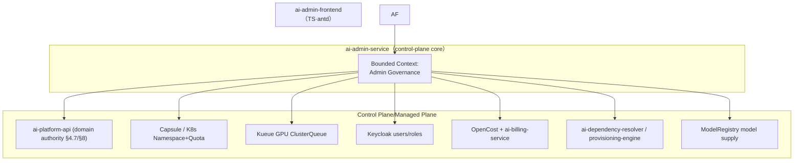
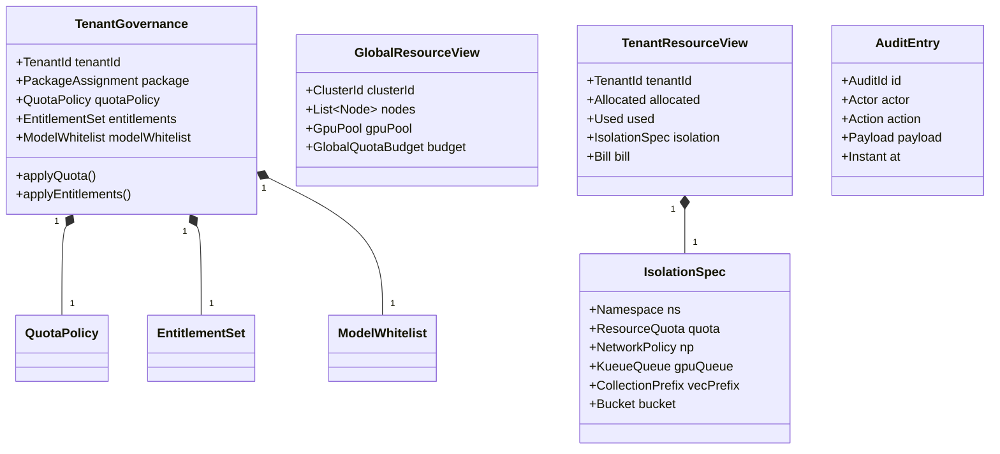
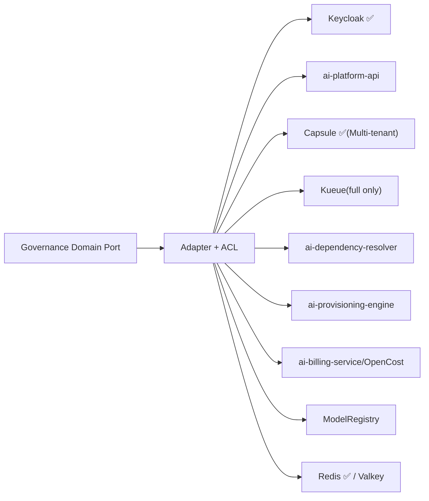
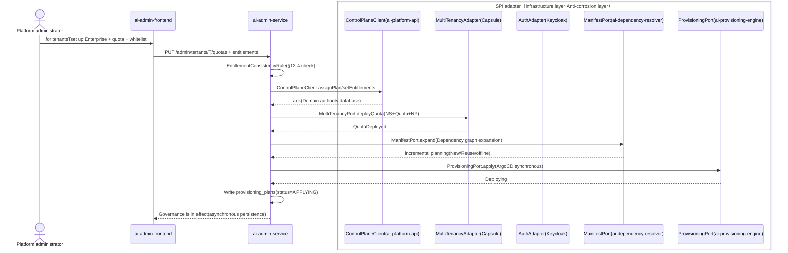
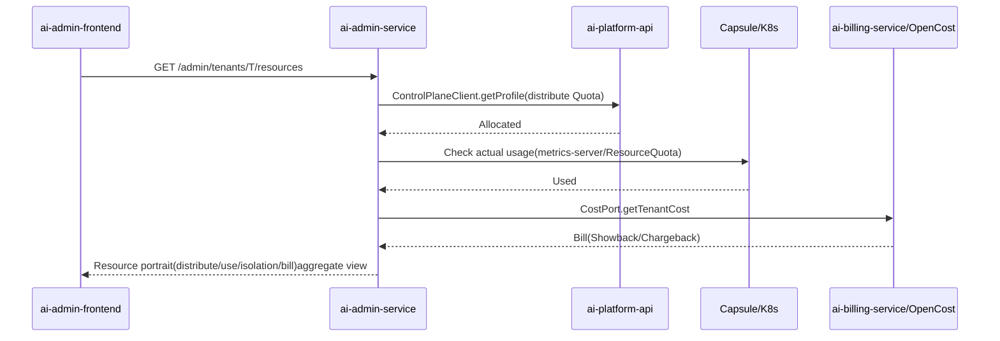

# ai-admin-service · Detailed design document

> **Meta Information**
> | item | value |
> | --- | --- | --- |
> | repo | `ai-admin-service` |
> | Language · Framework | Java · Spring Boot 3.x (Jakarta Persistence, §15.5.1) |
> | Domain | control-plane |
> | optional | No (core, starter~full enabled, see `repos.yaml` / `profiles/*.yaml`) |
> | Platform version | v1.0.0 |
> | Document Status | Draft |
> | Responsible person | OpenStrata Architecture Group |
> | Related links | [arch](./ARCH.md) · [skills](./SKILLS.md) · [specs](./SPECS.md) · Architecture document [§14](../../OpenStrata Architecture Design Document v2.8.md) [§8](../../OpenStrata Architecture Design Document v2.8.md) [§4.7](../../OpenStrata Architecture Design Document v2.8.md) [§12](../../OpenStrata Architecture Design Document v2.8.md) [§15.5](../../OpenStrata Architecture Design Document v2.8.md) [§16](../../OpenStrata Architecture Design Document v2.8.md) |

> This document covers the existing placeholder skeleton and does not change `arch/`, `skills/`, `specs/`, `README.md`. Chapters are strictly organized into 16 sections, and figures are always represented by live ```mermaid```.

---

## 1. Domain context and boundary (Bounded Context)

`ai-admin-service` is the backend of OpenStrata **Holistic Management Portal** (Architecture Document §14, new in v2.2). It is oriented to **platform administrators/tenant administrators**, unified management of "tenants, users, platform global resources, and tenant corresponding resources", and implements governance decisions into isolation carriers (Capsule/K8s/Kueue/Keycloak) and tenant-level `PlatformManifest` (§12). It complements the responsibilities of **Guide Portal** (ai-guide-portal, capability assembly): manage the Portal to set "boundaries" (quota + enableable components + model whitelist), and guide the Portal to allow users to "select capabilities" within the boundaries (§14).



- **Boundary (upstream)**: Only accept `Auth` SPI authentication (Keycloak, §4.7.3); platform-level vs tenant-level role scopes are strictly separated (§14.3).
- **Boundary (Downstream)**: It is the **governance orchestration backend**, which calls ai-platform-api (domain authority), Capsule/K8s (isolation), Kueue (GPU), Keycloak (user), OpenCost/billing (cost), dependency-resolver/provisioning (component start and stop) via SPI/ACL. It does not hold authoritative data of tenants/users (in the platform-api), only orchestrates and mirrors views.
- **Optional**: core, all four levels are enabled. Port 8088 (§15.2).

---

## 2. List of responsibilities and abilities (mapping §4 responsibilities at each level)

Align the four governance domains of §14 with §4.7 (security governance and multi-tenant layer):

| Capabilities | Description | Mapping § |
| --- | --- | --- |
| Tenant Management | Life Cycle CRUD/Package/Start/Stop/Isolation Configuration (§14.2) | §14.2 / §8.1 |
| User management | SSO/LDAP/AD docking, RBAC four roles, life cycle (§14.3) | §14.3 / §4.7.3 |
| Global Resource Management | Cluster Nodes/GPU Pools/Shared Services/Global Quotas/Platform Costs/Capacity Planning (§14.4) | §14.4 |
| Tenant Resource Management | Allocation vs Usage / Isolation Carrier / Billing (Showback/Chargeback, §14.5) | §14.5 / §8.3 |
| Quota distribution | Package quota → Capsule/Kueue/Gateway (§14.2/§14.5) | §8.2 / §14.5 |
| Component scoping | Tenants can enable component whitelisting → tenant `PlatformManifest` (§14.2) | §12.1 / §14.2 |
| Supplier Authorization | Open Third-Party Model by Tenant (§14.2) | §14.2 |
| Security and Audit | Administrator MFA, least privileges, full audit (§14.6) | §14.6 / §4.7.4 |
| Orchestration closed loop | Dependency graph expansion → dependency-resolver plan → provisioning incremental deployment (§14.5) | §13.3 |

---

## 3. Domain model (Aggregate / Entity / Value Object / Domain events)



**Aggregate (aggregate root)**: `TenantGovernance` (tenant governance aggregation: package + quota + component whitelist + model whitelist), `GlobalResourceView`, `TenantResourceView`, `AuditEntry` (immutable).

**Entity**: `QuotaPolicy`, `EntitlementSet`, `ModelWhitelist`, `IsolationSpec`, `Node`, `GpuPool`.

**Value Object (value object)**: `TenantId`/`ClusterId`/`AuditId`, `PackageAssignment` (Trial/Standard/Enterprise), `ResourceQuota` (CPU/ Mem/GPU/Token/QPS/Vector), `NetworkPolicy`, `KueueQueue`, `CollectionPrefix`, `Bucket`, `IsolationLevel`, `AuditAction`.

**Domain Events**
- `TenantGovernanceApplied` → Trigger Capsule/Kueue/Keycloak/Manifest to take effect.
- `QuotaDeployed` → Quota is distributed to K8s/gateway (§14.5).
- `EntitlementDeployed` → Override tenant `PlatformManifest.spec` (§12.1).
- `UserProvisioned` → Keycloak user/role synchronization (§14.3).
- `AuditRecorded` → Immutable auditing (§14.6).

---

## 4. Application layer use cases (Application Service & Use Case list)

| Use Case | Application Service | Transaction/Orchestration | Domain Events |
| --- | --- | --- | --- |
| Create/start and stop tenants (governance side) | `TenantGovAppService.create/suspend()` | Orchestration | `TenantGovernanceApplied` |
| Set package + quota | `QuotaGovAppService.assignPackage()` | Arrangement | `QuotaDeployed` |
| Set component whitelist | `EntitlementGovAppService.set()` | Arrangement | `EntitlementDeployed` |
| Authorization model provider | `ModelGovAppService.grant()` | Orchestration | `EntitlementDeployed` |
| User SSO docking/lifecycle | `UserGovAppService.syncLifecycle()` | Orchestration | `UserProvisioned` |
| Global resource view | `GlobalResourceAppService.view()` | Read (aggregate multiple sources) | — |
| Tenant resource portrait | `TenantResourceAppService.view()` | Read (aggregate multiple sources) | — |
| Trigger component change orchestration | `ProvisioningAppService.apply()` | Orchestration | `ManifestSynced` |
| Audit query | `AuditAppService.query()` | Read | — |

> The application layer is mainly **orchestration use cases**: distributing governance intentions to platform-api, Capsule, Kueue, Keycloak, dependency-resolver, etc. via SPI/ACL; reading and writing uses CQRS, and views come from multi-source aggregation Projection.

---

## 5. Domain services and core business rules

- **`QuotaDeploymentRule`**: package quota → K8s ResourceQuota + Kueue ClusterQueue + gateway `tenant×model` quota (§14.5). advanced defaults to governance CPU/Token/QPS/vector count; **GPU quota is only enabled for full-scale self-hosted inference** (§8.1 D5 / §14.4 D2).
- **`EntitlementConsistencyRule`**: The component whitelist must be compatible with the `PlatformManifest` dependency graph (§12.4); `billing` must have `multitenancy` and `multitenancy` must have `auth` turned on.
- **`IsolationEnforcementRule`**: Force "data does not leave the tenant" - Namespace + NetworkPolicy(deny-all) + data prefix (§14.2 / §8.2).
- **`ModelWhitelistRule`**: Only Enterprise tenants can authorize restricted models (§14.2).
- **`AdminMinPrivilegeRule`**: Strict separation of platform-level vs tenant-level roles; administrator operation MFA + full audit (§14.6).
- **`OrchestrationPlanRule`**: Component changes first go through the `ai-dependency-resolver` to generate an incremental plan (new addition/reuse/offline), and then submit it to the `ai-provisioning-engine` for execution (§13.3 / §14.5 closed loop).

---

## 6. SPI port and adapter (Port definition + Adapter + ACL anti-corrosion layer, mapping §10.4)

| Port (domain layer definition) | SPI port (bom.yaml) | Adapter implementation (default ✅ / alternative) | ACL responsibility |
| --- | --- | --- | --- |
| `AuthPort` | `Auth` (§4.7.3) | **Keycloak@25.0.0 ✅** | token/claims → `TenantContext`/`Role`; User synchronization |
| `ControlPlaneClient` | — (§4.7/§8) | REST calls to `ai-platform-api` | Internal governance DTO ⇄ platform-api domain objects (anti-corruption) |
| `MultiTenancyPort` | `MultiTenancy` (§8.2) | **Capsule@1.9.0 ✅** (optional, multi-tenant only) | Tenant CRD/Quota ⇄ Internal `IsolationSpec` |
| `GpuQueuePort` | — (§14.4/§9.3) | Kueue Adapter (full self-hosted only) | ClusterQueue ⇄ internal `KueueQueue` |
| `ManifestPort` | — (§12) | Call `ai-dependency-resolver` / write Manifest directly | Manifest DTO ⇄ Internal `TenantConfig` |
| `ProvisioningPort` | — (§13.3) | REST call to `ai-provisioning-engine` (ArgoCD) | Change plan ⇄ Deployment instructions (anti-corrosion) |
| `CostPort` | — (§8.3/§14.4) | REST/Query `ai-billing-service` + OpenCost | Cost/Bill ⇄ Internal `Bill` |
| `ModelRegistryPort` | — (§4.4.5) | REST calls to ModelRegistry | Model provisioning/authorization ⇄ Internal `ModelWhitelist` |
| `CachePort` | `Cache` (§4.3.4) | **Redis@7.4.0 ✅** / Valkey@7.2.0 optional | Resource view cache (tenant prefix) |



> **Multiple implementations coexist**: `CachePort` Redis/Valkey switches through the same Port coexistence with zero changes (§10.4 / §16.3); `MultiTenancyPort` only multi-tenant injects Capsule Adapter (0 Adapter=capability skipped, P10).

---

## 7. External API contract (REST/gRPC critical path, status code, error code, OpenAPI key points)

REST (Spring MVC + SpringDoc), prefix `/api/v1/admin`; for consumption by `ai-admin-frontend`, the platform-level interface requires platform-admin.

**Critical Path**

```text
GET    /api/v1/admin/tenants                         #Tenant list (platform level)
POST   /api/v1/admin/tenants                         #Create tenant (governance side)
PATCH  /api/v1/admin/tenants/{tenantId}              #Start/Stop/Package
PUT    /api/v1/admin/tenants/{tenantId}/quotas       #Quota issuance
PUT    /api/v1/admin/tenants/{tenantId}/entitlements# Component whitelist
PUT    /api/v1/admin/tenants/{tenantId}/model-grants# Model supplier authorization
GET    /api/v1/admin/global-resources                #Global resource view (§14.4)
GET    /api/v1/admin/gpu-pool                        #GPU pool (enabled in phase four)
GET    /api/v1/admin/tenants/{tenantId}/resources    #Tenant resource portrait (§14.5)
POST   /api/v1/admin/tenants/{tenantId}/components:apply #Trigger orchestration (§13.3)
GET    /api/v1/admin/users                           #User list
POST   /api/v1/admin/users:sync                      #SSO/lifecycle sync
GET    /api/v1/admin/audit                           #Audit queries (§14.6)
```

**Status code**: 2xx; `400` parameter/dependency verification violation; `401/403` authentication/privilege (non-platform-admin adjustment platform level); `404` resource does not exist; `409` quota conflict/whitelist conflict; `422` Manifest dependency verification failure (§12.4); `429` administrator operation frequency limit; `500` internal.

**Error code**

```json
{
  "code": "ENTITLEMENT_DEP_VIOLATION",
  "message": "To enable billing, multitenancy must be enabled (§12.4)",
  "traceId": "beef00",
  "doc": "https://docs.openstrata.io/errors/ENTITLEMENT_DEP_VIOLATION"
}
```

**OpenAPI key points**: `openapi.yaml` is generated by SpringDoc; quota/whitelist Schema reuses `PlatformManifest` (§12.1); the view aggregates multiple sources, and the response contains the `source` annotation (platform-api/capsule/billing).

---

## 8. Data model and persistence (table structure / JPA / migration script)

This service **does not hold authoritative business data** (in platform-api), but only persists **governance orchestration state and audit**:

```sql
-- Management governance library（shared schema: admin_gov）
CREATE TABLE tenant_governance (
  tenant_id        VARCHAR(64) PRIMARY KEY,
  package          VARCHAR(32) NOT NULL,        -- Trial/Standard/Enterprise
  quota_policy     JSONB       NOT NULL,         -- CPU/Mem/GPU/Token/QPS/Vector
  entitlements     JSONB       NOT NULL,         -- Component whitelist
  model_whitelist  JSONB       NOT NULL,
  isolation_spec   JSONB,                        -- Namespace/NP/Queue/Prefix/Bucket
  updated_at       TIMESTAMPTZ NOT NULL DEFAULT now()
);

CREATE TABLE provisioning_plans (
  plan_id     VARCHAR(64) PRIMARY KEY,
  tenant_id   VARCHAR(64) NOT NULL,
  manifest    JSONB       NOT NULL,             -- tenant PlatformManifest.spec
  status      VARCHAR(16) NOT NULL DEFAULT 'PENDING',  -- PENDING/APPLYING/DONE/FAILED
  created_at  TIMESTAMPTZ NOT NULL DEFAULT now()
);

CREATE TABLE audit_log (                        -- Immutable auditing（§14.6/§4.7.4）
  id          BIGSERIAL PRIMARY KEY,
  actor       VARCHAR(64) NOT NULL,
  scope       VARCHAR(8)  NOT NULL,             -- platform / tenant
  tenant_id   VARCHAR(64),
  action      VARCHAR(64) NOT NULL,
  payload     JSONB,
  created_at  TIMESTAMPTZ NOT NULL DEFAULT now()
);
CREATE INDEX idx_audit_tenant ON audit_log(tenant_id, created_at);
```

**JPA**: `TenantGovernanceEntity`/`ProvisioningPlanEntity`/`AuditEntryEntity`; JSONB serialized governance state; audit table **INSERT-ONLY** (immutable). Migrate **Flyway** (`V1__admin_init.sql`). The resource view (node/GPU/cost) is a runtime aggregation and does not fall into this library.

---

## 9. Key business processes and sequence diagrams (Mermaid sequence, including cross-service SPI calls)

**Process: Platform administrator sets packages for tenants → Quota distribution → Component whitelist → Orchestration closed loop (§14.5)**



**Process: Tenant resource portrait aggregation (§14.5)**



---

## 10. Configuration and Profile (align meta profiles: starter~full + optional capability switch)

This service switch aligns `profiles/*.yaml` with `PlatformManifest.spec` (§12.1); itself is always enabled, but its governance dimensions expand with the gear:

```yaml
openstrata:
  service:
    port: 8088
  features:
    admin:
      enabled: true                 #core, open all four gears
    gpuPool:
      enabled: false                #Only full file self-hosted inference is enabled (§14.4 D2)
    multiTenant:
      enabled: false                # starter/standard=false；advanced/full=true
    billingView:
      enabled: false                #Only multi-tenant (advanced/full) linkage ai-billing-service
    modelRegistry:
      enabled: true
  spi:
    auth:        { provider: keycloak }   # core
    multitenancy:{ provider: capsule }    #optional, multi-tenant only
    cache:       { provider: redis }      #valkey alternative (§16.3)
```

| Profile | Governance dimension expansion |
| --- | --- |
| starter | single tenant: basic tenant/user management, auditing; no Capsule/Kueue/billing |
| standard | Same as starter (still single tenant) |
| advanced | + multi-tenant governance (Capsule injection), quota provisioning, component whitelist, billing view |
| full | + GPU pool management (Kueue), self-hosted inference licensing, full cost/capacity planning |

---

## 11. Integration point (other dependent services/SPI/external OSS, reference bom.yaml)

| Integration Point | Type | Instance (bom.yaml) | Description |
| --- | --- | --- | --- |
| Keycloak | External OSS (Auth SPI) | keycloak@25.0.0 ✅ core | Users/roles/SSO (§4.7.3 / §14.3) |
| Capsule | External OSS (MultiTenancy SPI) | capsule@1.9.0 optional | Tenant isolation carrier (§8.2) |
| Redis / Valkey | External OSS (Cache SPI) | redis@7.4.0 ✅ / valkey@7.2.0 optional | View cache (§16.3) |
| PostgreSQL | base base | postgresql@16.0 ✅ core | governance/auditing |
| ai-platform-api | Internal Services | Java v1.0.0 | Domain Authority (§4.7/§8) |
| ai-dependency-resolver | Internal services | Go v1.0.0 | Dependency graph expansion (§13.3) |
| ai-provisioning-engine | Internal services | Go v1.0.0 | ArgoCD deployment execution (§13.3) |
| ai-billing-service | Internal Services | Java v1.0.0 | Cost/Billing (§8.3, multi-tenant only) |
| OpenCost | External OSS (Cost) | Reference §4.7.2 | K8s Resource Cost |
| ModelRegistry | Internal/External | modelProviders (§4.4.5) | Model Provisioners/Authorization (§14.2) |
| Kueue | External OSS | Reference §9.3 | GPU ClusterQueue (full only) |

---

## 12. Security and multi-tenancy (authentication/permissions/data isolation/auditing, mapping §8·§14)

- **Authentication**: via `AuthPort` (Keycloak OIDC/JWT); `X-Tenant-Id` injected by gateway; inter-service mTLS (Istio, §4.7.3).
- **Permissions**: RBAC four roles (platform-admin / tenant-admin / developer / viewer, §14.3); strict separation of platform-level vs tenant-level scopes; administrator MFA (§14.6).
- **Data Isolation**: Tenant data isolation is carried by Capsule/K8s (§8.2 Matrix); this service `tenant_governance` is isolated by `tenant_id` + RLS; the audit table leaves all traces (audited even if `security` is not opened, §14.6).
- **Minimum Privileges**: Platform administrators are not allowed to modify tenant data without explicit scope=tenant; all governance changes go through `AuditEntry` (immutable, §4.7.4).
- **Multi-tenant conditions**: `multiTenant.enabled` and `auth` is on (§12.4).

---

## 13. Observability (log/tracking/metrics/audit points)

- **Basic Tracing + Audit (core, §4.8)**: OTel traces + immutable `audit_log` enabled by default.
- **Metrics (recommended)**: `admin_gov_actions_total{action,scope}`, `provisioning_plan_status`, `quota_deploy_latency`, `tenant_count`, `gpu_pool_utilization` (full).
- **Logging**: Structured JSON + MDC `tenant_id`/`actor`; Loki optional.
- **Alerting**: Provisioning failed (`provisioning_plans=FAILED`), quota provisioning timed out via AlertManager (§4.8).

---

## 14. Deployment and elasticity (K8s resources/HPA/probes)

- **Deployment**: `ai-admin-service`, stateless, 2 replicas; image `openstrata/ai-admin-service:v1.0.0`.
- **namespace**: shared `ai-system` (§9.2); orchestrated actions affect `ai-tenant-{x}`.
- **Probe**:
  - liveness：`GET /actuator/health/liveness`
- readiness: `GET /actuator/health/readiness` (depends on PG/Redis/Keycloak/platform-api)
- **HPA**: Based on `cpu` + `admin_qps`, min 2 / max 6.
- **Resources**: request 500m/1Gi, limit 1 CPU/2Gi.
- **Configuration**: ConfigMap + Secret, Helm values ​​rendered by `ai-provisioning-engine` (§13.3); subject to `multiTenant`/`billing` dependency (§12.4).

---

## 15. Test strategy (single test/integration/contract test)

- **Single test (domain layer)**: `QuotaDeploymentRule`, `EntitlementConsistencyRule`, `IsolationEnforcementRule`, `OrchestrationPlanRule` pure logic single test, coverage ≥ 85%.
- **Integration**: Testcontainers (PostgreSQL + Redis) + Mock Adapter for platform-api/Capsule, verify orchestration links and audit logging.
- **SPI Contract**: `AuthPort`/`CachePort`/`MultiTenancyPort`/`ControlPlaneClient` checked against `bom.yaml` `interface_versions` (`bump-spi-version` of `skills/`).
- **Cross-service contracts**: `ControlPlaneClient` contract with `ai-platform-api`; orchestration contract with `ai-dependency-resolver`/`ai-provisioning-engine`; cost view contract with `ai-billing-service`.
- **E2E**: `demo/advanced` runs the whole link of "setting up packages → quota issuance → component whitelist → trigger orchestration → resource portrait aggregation".

---

## 16. Open issues and pending items

1. **Governance authority vs domain authority boundary**: admin-service orchestration and platform-api hold authoritative data, and their **single write point** for "package/quota" needs to be solidified with ADR (it is recommended that platform-api be the only write, and admin-service only initiates orchestration and mirrors views).
2. **GPU pool management timing**: §14.4 D2 clarifies that the GPU quota is only enabled for full-level self-hosted inference; whether the advanced-level GPU pool view is occupied or hidden requires unified UX.
3. **Organization eventually consistent SLA**: The convergence delay, failure retry and rollback strategy of `provisioning_plans` from PENDING→DONE are to be determined (refer to §13.5 Rollback).
4. **Audit cross-service aggregation**: The management plane audit is in this service, and the business plane audit is in platform-api/each service. Whether a unified audit bus (ELK, §4.7.4 optional) is needed is to be determined.
5. **Whitelist and Manifest Conflict**: When a tenant guides Portal optional components beyond the management Portal whitelist, the conflict resolution strategy (rejection vs. arraignment) needs to be solidified.
6. **BOM Alignment**: CRD/API changes for Capsule 1.9 → 2.x, Keycloak 25 → 26 need to be tracked in `bom.yaml` (§16.1).

---

> **Change Record**
> | Version | Date | Description |
> | --- | --- | --- |
> | v1.0-Draft | 2026-07-17 | Initial detailed design, covering the placeholder skeleton, 16 sections complete |

> **Traceability Matrix (this document section ↔ Architectural Design Document § number) **
> | Chapters | Architecture Documentation § |
> | --- | --- |
> | 1 Domain context | §14.1 / §4.7 / §8.1 |
> | 2 Responsibilities List | §14 / §4.7 |
> | 3 Domain Model | §15.5.2 / §14.2~14.5 |
> | 4 Application layer use cases | §15.5.2 ② |
> | 5 Domain Service Rules | §14.2 / §14.4 / §14.5 / §12.4 |
> | 6 SPI Ports and Adapters | §10.3 / §10.4 / §15.5.4 |
> | 7 External API Contract | §14 / §16.4 |
> | 8 Data Model | §14.6 / §8.2 / §16 base |
> | 9 Business process timing | §14.5 / §13.3 / §15.5.2.2 |
> | 10 Configuration and Profile | §12.1 / §12.2 / §12.4 |
> | 11 integration points | §4.7.3 / §15.2 / bom.yaml |
> | 12 Security and Multi-Tenancy | §8 / §14.3 / §14.6 / §4.7.4 |
> | 13 Observability | §4.8 |
> | 14 Deployment and Resilience | §9.2 |
> | 15 Testing Strategies | §15.5.5 |
> | 16 Open Questions | — |
